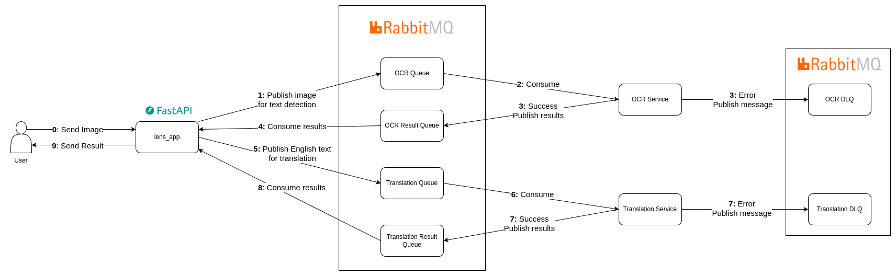

# lens-translate

This application can directly translate English text from images into Vietnamese.
The purpose of this project is to develop and deploy a machine learning application at scale.

## 1. Application Design
The application consists of the following components:

- **OCR Service** and **Translation Service** are separated services to improve scalability and overall application throughput.

### Architecture Flow
1. User uploads an image through the web [interface](index.html)
2. WebSocket connection is established with **lens-app** (built with FastAPI)
3. Image is sent to **OCR Service** for text detection via `OCR Queue`
4. **OCR Service** detects text in images and sends results to `OCR Results Queue`
5. **lens-app** receives results (bounding boxes and text) from `OCR Results` and forwards text to **Translation Service** via `Trans Queue`
6. **Translation Service** processes the text and returns results to **lens-app** via `Trans Results` queue
7. **lens-app** overlays translated text onto the original image using the bounding boxes and sends the result back to the user

## 2. Local Deployment

- Create `.env` file
```
RABBITMQ_USER=user
RABBITMQ_PASSWORD=password
```

- Launch docker compose
```bash
docker compose up -d
```

- Open [index.html](index.html) in web browser to use the application.

- You can supervise the queue (**RabbitMQ**) from `localhost:15672`
