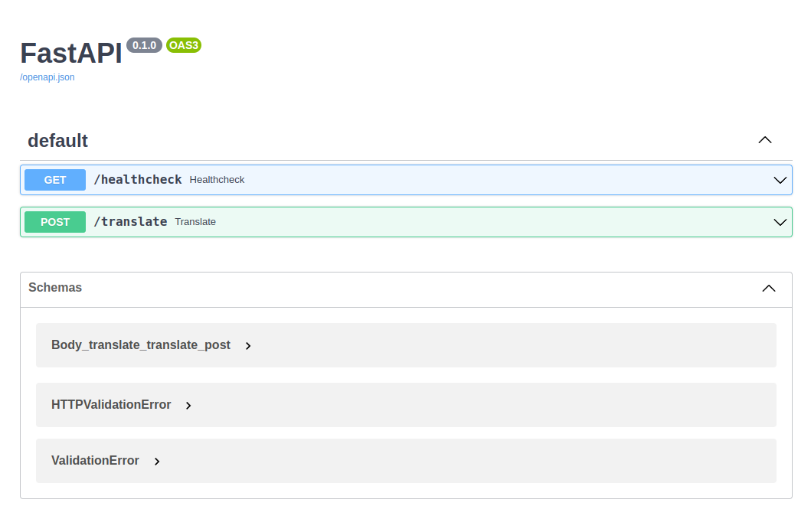

# lens-translate

This application can directly translate English text from images into Vietnamese.
The purpose of this project is to develop and deploy a machine learning application at scale.

## 1. Application Design
The application consists of the following components:

- **OCR Service** and **Translation Service** are separated services to improve scalability and overall application throughput.

### Architecture Flow
1. User uploads an image. Image is then sent to **lens-app**
2. Image is sent to **OCR Service** for text detection via `OCR Queue`
3. **OCR Service** detects text in images and sends results to `OCR Results Queue`
4. **lens-app** receives results (bounding boxes and text) from `OCR Results` and forwards text to **Translation Service** via `Trans Queue`
5. **Translation Service** processes the text and returns results to **lens-app** via `Trans Results` queue
6. **lens-app** overlays translated text onto the original image using the bounding boxes and sends the result back to the user

## 2. Local Deployment with docker compose

- Create `.env` file
```
RABBITMQ_USER=user
RABBITMQ_PASSWORD=password
```

- Launch docker compose
```bash
docker compose up -d
```

- Open `localhost:8000` in web browser and you should have the following **FastAPI** doc.


- You can supervise the queue (**RabbitMQ**) from `localhost:15672`


## 3. Local deployment K8S with minikube

### 3.0 Prerequisites
- Setup minikube
```bash
minikube start
minikube addons enable ingress
minikube tunnel
```

- Create namespace
```bash
kubectl create namespace model-serving
```

- Set your [secret](deployments/secret.yaml). You must encode your password using `base64` to be able to use with K8S Secret: `echo -n "YOUR PASSWORD" | base64`.
Set your password in secret. Then execute the following command to apply secret
```bash
cd deployments
kubectl apply -f secret.yaml
```

- Setup `jaeger` host for collecting tracing
```bash
cd deployments/monitoring/metrics/jaeger
helm upgrade --install jaeger .
```

### 3.1 RabbitMQ

```bash
cd deployments/rabbitmq
helm upgrade --install rabbitmq .
```

### 3.2 Nginx-ingress
```bash
cd deployments/nginx-ingress
helm upgrade --install nginx-ingress .
```

### 3.3 lens
- Get ClusterIP of `rabbitmq`
```bash
k get svc rabbitmq
```

- Get jaeger host and modify in `values.yaml`

- Copy ClusterIP to `deployments/lens/values.yaml`: `rabbitmq.host`
```bash
cd deployments/lens
helm upgrade --install lens .
```


### 3.4 Test
- Get Minikube IP
```bash
minikube ip
```

- Use web broser to access `minikubeIP/docs`. You should have the **FastAPI** doc.

## 4. Deployment on GCP

We deploy our system on GCP using VMs for logging and monitoring and GKE (Google Kubenetes Engine) for model serving.

The deployment order is
1. Deploy logging (ELK stack) on logging cluster
2. Deploy model serving with GKE
3. Deploy system monitoring & tracing on monitoring cluster

This section will go through each step.

### 4.1 Deploy Logging Cluster
- Create Cluster on GCP

**Step 2: Create **monitoring** namespace**
```bash
kubectl create namespace monitoring
```

**Step 3: Add secret**
```bash
cd deployments/logging
kubectl apply -f secret.yaml
```

**Step 4: Deploy `elasticsearch`**
- Launch `elasticsearch`
```bash
cd deployments/logging/elasticsearch
helm upgrade --install elasticsearch .
```
- Get `certificate` generated by `elasticsearch` which is needed for model-serving cluster to push logs to `elasticsearch`.
```bash
k get secrets --namespace=monitoring elasticsearch-master-certs -ojsonpath='{.data}' > cert.json
```
Copy `ca.crt`, `tls.crt` and `tls.key` value and place in model-serving cluster's [certificate](deployments/model-serving/elasticsearch-cert.yaml).

- Get `elasticsearch` load balancer IP. We need it for model-serving cluster.
```bash
k get svc elasticsearch-master --output jsonpath='{.status.loadBalancer.ingress[0].ip}'
```
Copy the result and replace the IP value in filebeat's [value.yaml](deployments/model-serving/filebeat/values.yaml) of `model-serving` cluster at: `.daemonset.fileBeatConfig.filebeat.yaml.output.elasticsearch.hosts`. For example in my case, the IP of elasticsearch's load balancer is `35.184.204.145`.
```yaml
output.elasticsearch:
    host: '${NODE_NAME}'
    hosts: '35.184.204.145:9200'
    username: '${ELASTICSEARCH_USERNAME}'
    password: '${ELASTICSEARCH_PASSWORD}'
    protocol: https
    ssl.certificate_authorities: ["/usr/share/filebeat/certs/ca.crt"]
```


**Step 5: Deploy `filebeat` on logging cluster**
```bash
cd deployments/logging/filebeat
helm upgrade --install filebeat .
```

**Step 6: Deploy `kibana`**
```bash
cd deployments/logging/kibana
helm upgrade --install kibana .
```
- Get LoadBalancer's IP
```bash
k get svc kibana-kibana --output jsonpath='{.status.loadBalancer.ingress[0].ip}'
```
- Connect to kibana platform. Sign in with username `elastic`, you can get password by the following command
```bash
kubectl get secrets --namespace=monitoring elasticsearch-master-credentials -ojsonpath='{.data.password}' | base64 -d
```

- Go to **observability/Logs`, you should see some logs as following image.


**Step 7: Deploy `Jaeger` for tracing**


### 4.3 Deploy Model Serving Cluster
- Create Model serving cluster on GCP

**Step 2: Create namespace & secrets**
- Namespace
```bash
kubectl create namespace model-serving
```
- Create secret
```bash
cd deployments/model-serving
kubectl apply -f elasticsearch-cert.yaml -f secret.yaml
```

**Step 3: Deploy rabbitmq**
```bash
cd deployments/model-serving/rabbitmq
helm upgrade --install rabbitmq .
```
- You can try to connect to `rabbitmq` by:
```bash
k port-forward svc/rabbitmq 15672:15672
```
- Connect to `localhost:15672` with username: `rabbitmq` and password from the following command
```bash
echo "Password      : $(kubectl get secret --namespace model-serving rabbitmq-credentials -o jsonpath="{.data.rabbitmq-password}" | base64 -d)"
```

**Step 4: Deploy nginx-ingress**
```bash
cd deployments/model-serving/nginx-ingress
helm upgrade --install nginx-ingress .
```

**Step 5: Deploy filebeat**
```bash
cd deployments/model-serving/filebeat
helm upgrade --install filebeat .
```

**Step 6: Deploy node-exporter**
```bash
cd deployments/model-serving/node-exporter
helm upgrade --install node-exporter .
```

**Step 7: Deploy cadvisor**
```bash
cd deployments/model-serving/cadvisor
helm upgrade --install cadvisor .
```


**Step 8: Deploy app**
