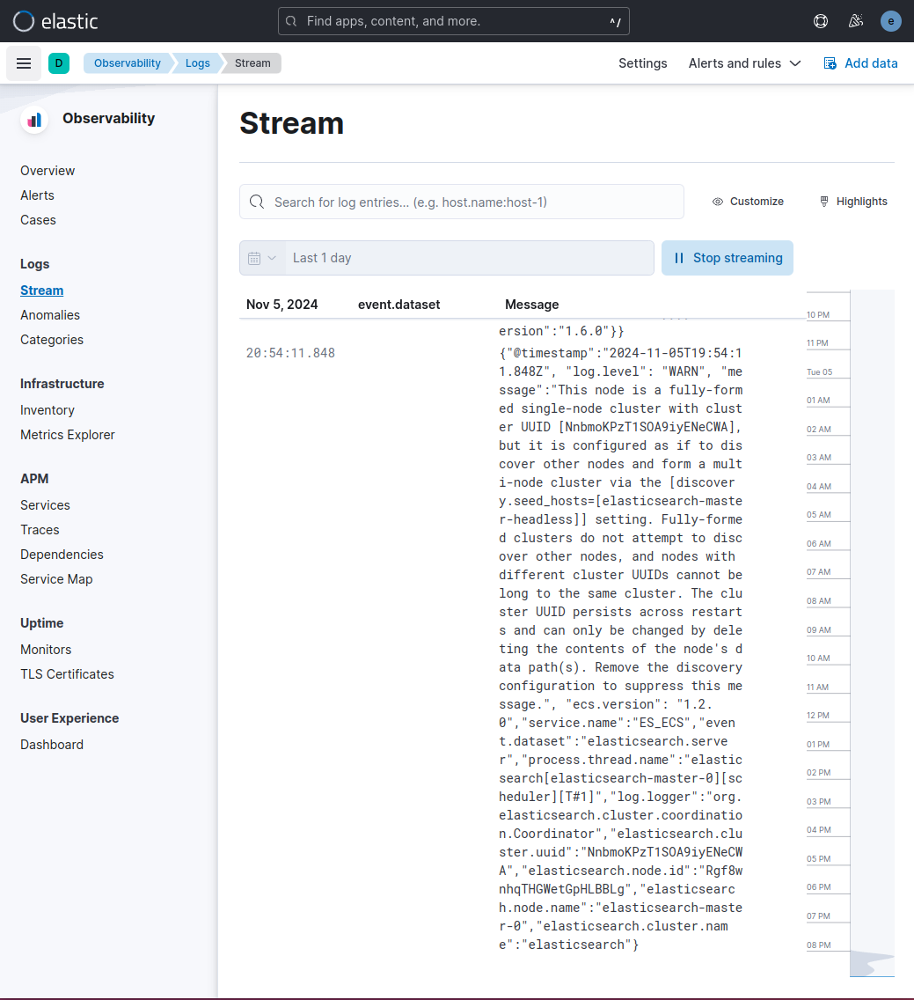
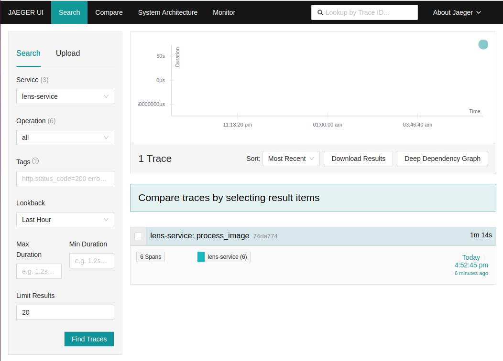

# lens-translate

This application can directly translate English text from images into Vietnamese.
The purpose of this project is to develop and deploy a machine learning application at scale.

## 1. Application Design
The application consists of the following components:

- **OCR Service** and **Translation Service** are separated services to improve scalability and overall application throughput.

### Architecture Flow
1. User uploads an image. Image is then sent to **lens-app**
2. Image is sent to **OCR Service** for text detection via `OCR Queue`
3. **OCR Service** detects text in images and sends results to `OCR Results Queue`
4. **lens-app** receives results (bounding boxes and text) from `OCR Results` and forwards text to **Translation Service** via `Trans Queue`
5. **Translation Service** processes the text and returns results to **lens-app** via `Trans Results` queue
6. **lens-app** overlays translated text onto the original image using the bounding boxes and sends the result back to the user

## 2. Local Deployment with docker compose

Create `.env` file
```
# RabbitMQ
RABBITMQ_USER=user
RABBITMQ_PASSWORD=password

# Monitoring: Elasticsearch
ELASTIC_VERSION=8.4.1
ELASTIC_PASSWORD=password
LOGSTASH_INTERNAL_PASSWORD=password
KIBANA_SYSTEM_PASSWORD=password
FILEBEAT_INTERNAL_PASSWORD=password

# Grafana
GF_SECURITY_ADMIN_USER=admin
GF_SECURITY_ADMIN_PASSWORD=admin

# Metrics
METRIC_SERVICE_NAME_LENS=lens-service
METRIC_SERVICE_VERSION_LENS=0.0.1
METRIC_SERVICE_NAME_OCR=ocr-service
METRIC_SERVICE_VERSION_OCR=0.0.1
METRIC_SERVICE_NAME_TRANSLATION=translation-service
METRIC_SERVICE_VERSION_TRANSLATION=0.0.1
JAEGER_AGENT_HOST=jaeger
JAEGER_AGENT_PORT=6831
```

Launch docker compose
```bash
docker compose up -f elk-docker-compose.yml -f metric-docker-compose.yml -f serving-docker-compose.yml  -d
```

Open `localhost:8000` in web browser and you should have the following **FastAPI** doc.


You can access different tool at:
- **RabbitMQ**: `localhost:15672`
- **Kibana**: `localhost:5601`
- **prometheus**: `localhost:9090`
- **grafana**: `localhost:3045`

## 3. CI/CD

## 4. Deployment on Google Cloud Platform

We deploy our system on Google Cloud Platform (GCP) using three distinct clusters:

1. **Logging Cluster**: Hosts the ELK stack and Jaeger for comprehensive logging and tracing.
2. **Metrics Cluster**: Contains the Prometheus server and Grafana for effective monitoring.
3. **Model Serving Cluster**: Dedicated to model serving operations.


### 4.1 Create clusters with `terraform`
You need **terraform** to setup the clusters. [Instal guide here](https://computingforgeeks.com/how-to-install-terraform-on-ubuntu/).

Authenticate
```bash
gcloud auth application-default login
```
Launch cluster generation
```bash
cd terraform
terraform init
terraform plan
terraform apply
```
You should find your clusters being created as below


### 4.1 Deploy clusters
Because the deployment process can be lengthy and complex, a `Makefile` and accompanying `bash` script have been implemented to automate and streamline the entire process. It is recommended to use these tools to deploy the system efficiently.
- Setup env variables: Modify `deployments/env.sh` with your `PROJECT_ID` and `ZONE` of your cluster. The zone is used in terraform is `us-central1-c` by default.
```
export PROJECT_ID=YOUR_GCP_PROJECT_ID
export ZONE=us-central1-c
```
- Launch
```bash
cd deployments
source ./env.sh
source ./deploy.sh all
```
When the deployment finishes, you have a file at `deployments/variables.sh` which contains some env variables. They are necessary information to connect to our system (application, logging, monitoring, tracing).


>For step-by-step setup (very long), please follow the deployment guide [here](deployments/STEP-BY-STEP.md).

When the process finishes, you put the IP (`echo $APP_IP` to get IP of the application) in your `/etc/hosts`: `THE_IP_OF_APP app.example.com`

**Kibana**
- `echo $KIBANA_IP` to get kibana address.
- Connect with username `elastic` and password $KIBANA_PASSWORD.


**Jaeger**
- `echo $JAEGER_QUERY_HOST` to get JaegerUI address.


**Grafana**
- `echo $GRAFANA_IP` and you can access to grafana with that address.
- Username is `admin` and Password
```bash
echo $GRAFANA_PASSWORD
```
- Go to dashboard, Click `New` - `Import`.

- Type `14282` as dashboard ID then `Load` and enjoy your dashboard


**Application**
- Connect to `app.example.com/docs`.
- Try `translate` with the example image in `images/example.jpeg`. The inference time is quite slow.
- You can check kibana, jaeger and grafana for all the logs, metrics and tracings.

