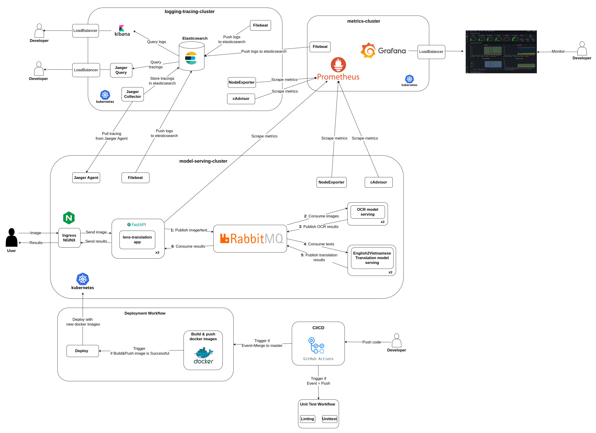

# lens-translate

This application can directly translate English text from images into Vietnamese.
The purpose of this project is to develop and deploy a machine learning application at scale.

## 1. System architecture with Kubernetes (K8s)



### Note
-  **deployments**: Deploy clusters with K8s and `helm`
- **lens**: `lens-translation` application
- **monitoring**: configs for monitoring system, only use for local deployment with `docker compose`
- **ocr-app**: OCR model serving
- **terraform**: Create clusters on GCP
- **trans-app**: Translation model serving
- **unitests**: Unit test for CI/CD
- **images**: images for documentation


### Model serving flow


1. User uploads an image. Image is then sent to **lens-app**
2. Image is sent to **OCR Service** for text detection via `OCR Queue`
3. **OCR Service** detects text in images and sends results to `OCR Results Queue`
4. **lens-app** receives results (bounding boxes and text) from `OCR Results` and forwards text to **Translation Service** via `Trans Queue`
5. **Translation Service** processes the text and returns results to **lens-app** via `Trans Results` queue
6. **lens-app** overlays translated text onto the original image using the bounding boxes and sends the result back to the user

## 2. Local Deployment with docker compose

Create `.env` file
```
# RabbitMQ
RABBITMQ_USER=user
RABBITMQ_PASSWORD=password

# Monitoring: Elasticsearch
ELASTIC_VERSION=8.4.1
ELASTIC_PASSWORD=password
LOGSTASH_INTERNAL_PASSWORD=password
KIBANA_SYSTEM_PASSWORD=password
FILEBEAT_INTERNAL_PASSWORD=password

# Grafana
GF_SECURITY_ADMIN_USER=admin
GF_SECURITY_ADMIN_PASSWORD=admin

# Metrics
METRIC_SERVICE_NAME_LENS=lens-service
METRIC_SERVICE_VERSION_LENS=0.0.1
METRIC_SERVICE_NAME_OCR=ocr-service
METRIC_SERVICE_VERSION_OCR=0.0.1
METRIC_SERVICE_NAME_TRANSLATION=translation-service
METRIC_SERVICE_VERSION_TRANSLATION=0.0.1
JAEGER_AGENT_HOST=jaeger
JAEGER_AGENT_PORT=6831
```

Launch docker compose
```bash
docker compose up -f elk-docker-compose.yml -f metric-docker-compose.yml -f serving-docker-compose.yml  -d
```

Open `localhost:8000` in web browser and you should have the following **FastAPI** doc.


You can access different tool at:
- **RabbitMQ**: `localhost:15672`
- **Kibana**: `localhost:5601`
- **prometheus**: `localhost:9090`
- **grafana**: `localhost:3045`


## 3. Deployment on Google Cloud Platform

We deploy our system on Google Cloud Platform (GCP) using three distinct clusters:

1. **Logging Cluster**: Hosts the ELK stack and Jaeger for comprehensive logging and tracing.
2. **Metrics Cluster**: Contains the Prometheus server and Grafana for effective monitoring.
3. **Model Serving Cluster**: Dedicated to model serving operations.


### 3.1 Create clusters with `terraform`
You need **terraform** to setup the clusters. [Instal guide here](https://computingforgeeks.com/how-to-install-terraform-on-ubuntu/).

Authenticate
```bash
gcloud auth application-default login
```
Launch cluster generation
```bash
cd terraform
terraform init
terraform plan
terraform apply
```
You should find your clusters being created as below


### 3.2 Deploy clusters
Because the deployment process can be lengthy and complex, a `bash` script has been implemented to automate and streamline the entire process. It is recommended to use these tools to deploy the system efficiently.
- Setup env variables: Modify `deployments/env.sh` with your `PROJECT_ID` and `ZONE` of your cluster. The zone is used in terraform is `us-central1-c` by default.
```
export PROJECT_ID=YOUR_GCP_PROJECT_ID
export ZONE=us-central1-c
```
- Launch
```bash
cd deployments
source ./env.sh
source ./deploy.sh all
```
When the deployment starts, you have the logs in your terminal as below.


When the deployment finishes, you have a file at `deployments/variables.sh` which contains some env variables. They are necessary information to connect to our system (application, logging, monitoring, tracing). Example:
```bash
export ELASTICSEARCH_IP=34.69.4.124
export KIBANA_IP=34.135.248.187
export KIBANA_PASSWORD=lensappelastic
export JAEGER_COLLECTOR_HOST=34.30.199.54
export JAEGER_QUERY_HOST=35.232.197.109
export LOGGING_NODE_IP=34.31.28.88
export RABBITMQ_PASSWORD=asdfvcxefaf
export MODEL_SERVING_NODE_IP=34.57.188.243
export APP_METRIC_HOST=35.222.162.147
export APP_IP=34.133.128.72
export PROMETHEUS_IP=34.56.219.246
export GRAFANA_IP=34.122.44.148
export GRAFANA_PASSWORD=QREvEFco4QztMbj8D7aeFQqfbFA8TDt8Q2TuohiH
```
You can do `source ./deployments/variables.sh` to set these env variables in your current shell.


>For step-by-step setup (very long), please follow the deployment guide [here](deployments/STEP-BY-STEP.md).

When the process finishes, you put the IP (`$APP_IP`) in your `/etc/hosts`: `THE_IP_OF_APP app.example.com`

**Kibana**
- `echo $KIBANA_IP` to get kibana address.
- Connect with username `elastic` and password $KIBANA_PASSWORD.


**Jaeger**
- `echo $JAEGER_QUERY_HOST` to get JaegerUI address.


**Grafana**
- `echo $GRAFANA_IP` and you can access to grafana with that address.
- Username is `admin` and Password
```bash
echo $GRAFANA_PASSWORD
```
- Go to dashboard, Click `New` - `Import`.

- Type `14282` as dashboard ID then `Load` and enjoy your dashboard


**Application**
- Connect to `app.example.com/docs`.
- Try `translate` with the example image in `images/example.jpeg`. The inference time is quite slow. **The expected results:**


- You can check kibana, jaeger and grafana for all the logs, metrics and tracings.


## 4. Setup CI/CD
GitHub Actions is utilized for the CI/CD processes in this project. There are two workflows:

- **Unittest**: This workflow handles linting and unit tests. It is triggered with every push to any branch.
- **Deployment**: This workflow is activated after a merge or a push to the `master` branch, except when the changes are limited to markdown files. It builds new Docker images and pushes them to Docker Hub, using the commit hash as the image tag. Once the new Docker images are pushed, the application is automatically updated with these images.

**Unit test workflow**


**Deployment workflow**


In order to use this CI/CD, follow the following guide.

### 4.1 Setup Google service account
- Search for **Service Accounts** on Google Cloud Platform.


- Click on **Create Service Account**


- Fill in **Account name** and **Description**, then click **Create and Continue**


- Select the role of this service account, you can choose as below. This role allows to manage GKE clusters.

- Click on the account that you create, go on **Keys**, then choose **Add key** --> **Create new key** (choose json)


- You download the service account key file. We will add it in github secrets to use in our deployment workflow.

### 4.2 Setup github action secrets & variables
- From repository, click **Setting**


- From **Security**, choose **Secrets and variables**, then **Action**.


- Choose **Variables**, **New repository variable**. Create 2 variables:
    - `GKE_CLUSTER`: `model-serving-cluster`
    - `GKE_ZONE`: `us-central1-c` (if you use other zone in terraform/main.tf, you put your zone here).


- Choose **Secrets**, **New repository secret**. Create following secrets:
    - **DOCKER_USERNAME**: dockerhub account to push built images during CI/CD
    - **DOCKER_PASSWORD**: password of dockerhub account
    - **GCP_CREDENTIALS**: copy the content of the GCP `service account key file` created in **Section 4.1**. This file is used to authenticate to GCP.
    - **GCP_SERVICE_ACCOUNT**: the service account ID
    - **GKE_PROJECT**: name of the GCP project.


###
