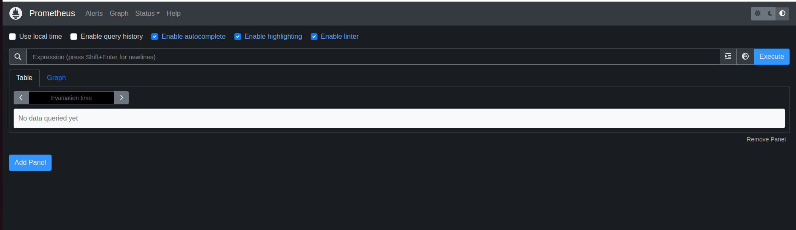

# Deploy system on Google Cloud Platform

## 1. Deploy Logging Cluster

### Step 1: Create **monitoring** namespace
- Connect
```bash
gcloud container clusters get-credentials logging-cluster --zone us-central1-c --project PROJECT-NAME
```
- Create namespace
```bash
kubectl create namespace logging && kubens logging
```

### Step 2: Add secret
```bash
cd deployments/logging
kubectl apply -f secret.yaml
```

### Step 3: Deploy `elasticsearch`
- Launch `elasticsearch`
```bash
helm upgrade --install elasticsearch ./elasticsearch
```
- Wait until the elasticsearch pod is ready. Then get `certificate` generated by `elasticsearch` which is needed for model-serving cluster to push logs to `elasticsearch`.
```bash
k get secrets --namespace=logging elasticsearch-master-certs -ojsonpath='{.data}' > cert.json
```
Copy `ca.crt`, `tls.crt` and `tls.key` value and place in model-serving cluster's [certificate](model-serving/elasticsearch-cert.yaml) and metric-cluster 's [certificate](metrics/elasticsearch-cert.yaml).

- Get `elasticsearch` load balancer IP. We need it for model-serving cluster.
```bash
k get svc elasticsearch-master --output jsonpath='{.status.loadBalancer.ingress[0].ip}'
```
Copy the result and replace the IP value in filebeat's [value.yaml](model-serving/filebeat/values.yaml) of `model-serving` cluster at: `.daemonset.fileBeatConfig.filebeat.yaml.output.elasticsearch.hosts` of **model-serving** cluster. For example in my case, the IP of elasticsearch's load balancer is `35.184.204.145`.
```yaml
output.elasticsearch:
    host: '${NODE_NAME}'
    hosts: '35.184.204.145:9200'
    username: '${ELASTICSEARCH_USERNAME}'
    password: '${ELASTICSEARCH_PASSWORD}'
    protocol: https
    ssl.certificate_authorities: ["/usr/share/filebeat/certs/ca.crt"]
```
- Similar for filebeat's [values.yaml](metrics/filebeat/values.yaml) of **metrics** cluster.

### Step 4: Deploy `filebeat` on logging cluster
```bash
helm upgrade --install filebeat ./filebeat
```

### Step 5: Deploy `kibana`
```bash
helm upgrade --install kibana ./kibana
```
- Get LoadBalancer's IP
```bash
k get svc kibana-kibana --output jsonpath='{.status.loadBalancer.ingress[0].ip}'
```
- Connect to kibana platform. Sign in with username `elastic`, you can get password by the following command
```bash
kubectl get secrets --namespace=logging elasticsearch-master-credentials -ojsonpath='{.data.password}' | base64 -d
```

```bash
kubectl get all --namespace=logging --no-headers | grep kibana | awk '{print $1}' | xargs -I {} kubectl delete {} --namespace=logging
k delete serviceaccounts pre-install-kibana-kibana && k delete configmaps kibana-kibana-helm-scripts && k delete roles.rbac.authorization.k8s.io pre-install-kibana-kibana && k delete rolebindings.rbac.authorization.k8s.io pre-install-kibana-kibana
```

- Go to **observability/Logs**, you should see some logs as following image.


### Step 6: Deploy `Jaeger` for tracing
- Deploy **jaeger collector** and **jaeger query** to collect and access tracing from `model-serving` cluster. `model-serving` cluster will have its own **jaeger agent** to collect and push logs to this **jaeger collector**.
```bash
helm upgrade --install jaeger ./jaeger
```
- `Jaeger` use the same `elasticsearch` database to store tracing.

- Get IP of **jaeger collector** SVC
```bash
k get svc jaeger-collector --output jsonpath='{.status.loadBalancer.ingress[0].ip}'
```

- Put it in `model-serving`'s jaeger agent [values.yaml](model-serving/jaeger/values.yaml) at `agent.extraEnv.value`. For example: IP of **jaeger collector** is `34.172.165.133`:
```yaml
extraEnv:
    - name: REPORTER_GRPC_HOST_PORT
      value: 34.172.165.133:14250
```
(The port is 14250 by default)

- Get IP of **jaeger query** SVC.
```bash
k get svc jaeger-query --output jsonpath='{.status.loadBalancer.ingress[0].ip}'
```
Connect to JaegerUI at that IP with web browser.


### Step 7: Deploy `node exporter`
```bash
helm upgrade --install node-exporter ./node-exporter
```

### Step 8: Deploy `cadvisor`
```bash
helm upgrade --install cadvisor ./cadvisor
```


## 2. Deploy Model Serving Cluster

### Step 1: Create namespace
- Connect
```bash
gcloud container clusters get-credentials logging-cluster --zone us-central1-c --project PROJECT-NAME
```
- Namespace
```bash
kubectl create namespace model-serving && kubens model-serving
```

### Step 2: Create secrets
- Create secret
```bash
cd deployments/model-serving
kubectl apply -f elasticsearch-cert.yaml -f secret.yaml
```

### Step 3: Deploy rabbitmq
```bash
helm upgrade --install rabbitmq ./rabbitmq
```
- You can connect to `rabbitmq` by:
```bash
k port-forward svc/rabbitmq 15672:15672
```
- Connect to `localhost:15672` with username: `rabbitmq` and password from the following command
```bash
echo "Password      : $(kubectl get secret --namespace model-serving rabbitmq-credentials -o jsonpath="{.data.rabbitmq-password}" | base64 -d)"
```

### Step 4: Deploy nginx-ingress
```bash
helm upgrade --install nginx-ingress ./nginx-ingress
```

### Step 5: Deploy filebeat
```bash
helm upgrade --install filebeat ./filebeat
```

### Step 6: Deploy node-exporter
```bash
helm upgrade --install node-exporter ./node-exporter
```

### Step 7: Deploy cadvisor
```bash
helm upgrade --install cadvisor ./cadvisor
```

### Step 8: Deploy jaeger agent as daemonset
```bash
helm upgrade --install jaeger ./jaeger
```

### Step 9: Deploy app
```bash
helm upgrade --install app ./lens
```
- You can check quickly `rabbitmq` (at `localhost:15672`) if you use command `k port-forward svc/rabbitmq 15672:15672
`. You can see there are new connections, channels and queues.
- Get `ingress` IP
```bash
kubectl get ingress app-nginx-ingress -ojsonpath='{.status.loadBalancer.ingress[0].ip}'
```
- Copy `IP` and put in `/etc/hosts`
```
35.193.97.188 lens.example.com
```
- Open the [app](http://lens.example.com/docs)


## 3. Deploy Metric Cluster

### Step 1: Setup prometheus configuration
There are 5 sources:
- `logging-cluster`'s **node-exporter**
- `logging-cluster`'s **cadvisor**
- `model-serving-cluster`'s **node-exporter**
- `model-serving-cluster`'s **cadvisor**
- Application metrics

The first 4 metrics are exposed by **NodePort** service so we need to get IP of 1 node of `logging-cluster` and of `model-serving-cluster`.
- Get Host of `logging-cluster`'s node-exporter and cadvisor
```bash
gcloud container clusters get-credentials logging-cluster --zone us-central1-c --project PROJECT # connect to logging-cluster
kubectl get nodes -o jsonpath="{.items[0].status.addresses[?(@.type=='ExternalIP')].address}"
```
Get the IP and put it in prometheus's [values.yaml](deployments/metrics/prometheus/values.yaml) at `serverFiles.prometheus.yaml.scrape_configs`. There are 2 scraping jobs to modify:
```yaml
- job_name: "logging-cluster-node-exporter"
  scrape_interval: 5s
  static_configs:
    - targets: ["34.28.93.207:9100"]
- job_name: "logging-cluster-cadvisor"
  scrape_interval: 5s
  static_configs:
    - targets: ["34.28.93.207:55000"]
```
**Port is always the same: 9100 for node-exporter and 550000 for cadvisor**

- Get Host of `model-serving-cluster`'s node-exporter and cadvisor
```bash
gcloud container clusters get-credentials model-serving-cluster --zone us-central1-c --project PROJECT # connect to model-serving-cluster
kubectl get nodes -o jsonpath="{.items[0].status.addresses[?(@.type=='ExternalIP')].address}"
```
Get the IP and put it in prometheus's [values.yaml](metrics/prometheus/values.yaml) at `serverFiles.prometheus.yaml.scrape_configs`. There are 2 scraping jobs to modify:
```yaml
- job_name: "model-serving-cluster-node-exporter"
  scrape_interval: 5s
  static_configs:
    - targets: ["34.28.93.207:9100"]
- job_name: "model-serving-cluster-cadvisor"
  scrape_interval: 5s
  static_configs:
    - targets: ["34.28.93.207:55000"]
```
**Port is always the same: 9100 for node-exporter and 550000 for cadvisor**

- Get address for application metrics
```bash
kubens model-serving
kubectl get svc app-lens-app-metrics -ojsonpath='{.status.loadBalancer.ingress[0].ip}'
```
Put the IP in prometheus's [values.yaml](metrics/prometheus/values.yaml) at `serverFiles.prometheus.yaml.scrape_configs`:
```yaml
- job_name: "lens-app"
  scrape_interval: 5s
  static_configs:
    - targets: ["34.69.70.149:8099"]
```

### Step 1: Create namespace and create secret
- Connect
```bash
gcloud container clusters get-credentials metrics-cluster --zone us-central1-c --project PROJECT
```

- Create namespace
```bash
k create namespace metrics && kubens metrics
```
- Create secret
```bash
cd deployments/metrics
kubectl apply -f elasticsearch-cert.yaml -f secret.yaml
```

### Step 2: Deploy filebeat
```bash
helm upgrade --install filebeat ./filebeat
```

### Step 3: Deploy prometheus
- Deploy
```bash
helm upgrade --install prometheus ./prometheus
```
- Get IP of prometheus server
```bash
kubectl get svc prometheus-server -ojsonpath='{.status.loadBalancer.ingress[0].ip}'
```
You can access to prometheus with that IP.


### Step 4: Deploy grafana
- Deploy
```bash
helm upgrade --install grafana ./grafana
```
- Get IP of prometheus server
```bash
kubectl get svc grafana -ojsonpath='{.status.loadBalancer.ingress[0].ip}'
```
You can access to prometheus with that IP.

- Username is `admin` and Password
```bash
kubectl get secret --namespace metrics grafana -o jsonpath="{.data.admin-password}" | base64 --decode ; echo
```
- Go to dashboard, Click `New` - `Import`.

- Type `14282` as dashboard ID then `Load` and enjoy your dashboard

